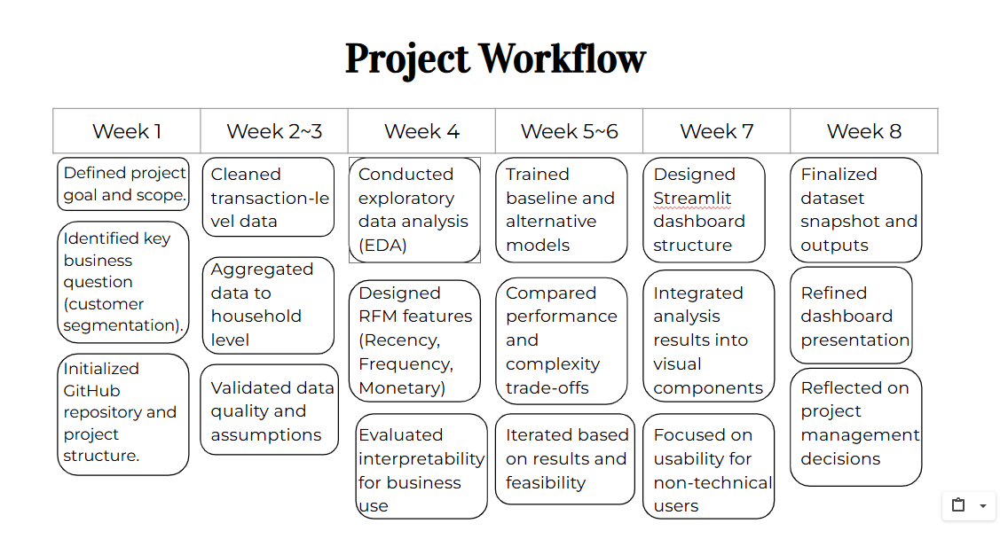
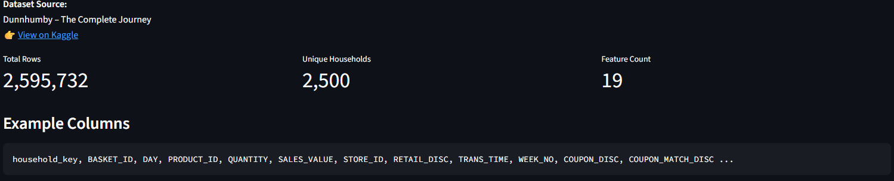
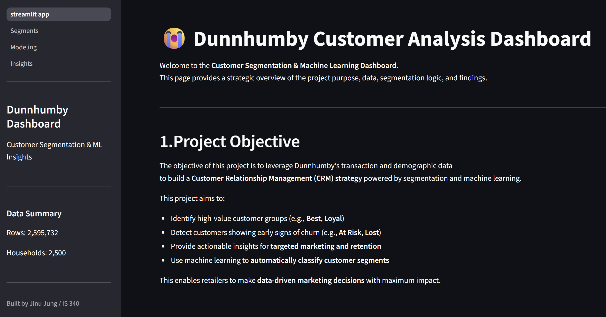

# From Raw Data to Dashboard:  
Managing a Marketing Analytics Project with Real Retail Data
Jinu Jung  
Dashboard: https://huggingface.co/spaces/JinRosso/dashboard_dashboard

## Why This Project
My academic background is at the intersection of business and Information Sciences, and much of my interest lies in how data is used to support real decision-making. Through my coursework and past project experience, I have become particularly drawn to marketing analytics and machine learning, not just as technical tools, but as means to understand behavior and communicate insights. This project came from that interest. Rather than treating the final assignment as a purely conceptual one, I decided to work through a full data project from start to finish. I chose to focus on retail transaction data because it reflects the kind of complexity found in real-world marketing problems, where data is rich but rarely clean.
Using the Dunnhumby Complete Journey dataset, which I found on Kaggle,  I set out to build a complete marketing analytics pipeline, moving from raw transaction data to customer-level analysis and finally to building a dashboard. I intended to understand how decisions around data structure, feature design, modeling, and communication interact across an end-to-end workflow.
I also approached this project as an opportunity to build something that reflects how I think about data work. By fully implementing the project and developing the dashboard, I aimed to create something that demonstrates not only technical ability but also how analysis can be shaped into something interpretable, understandable, communicable, and useful.

## Project Vision and Goals 
In the early stages of this project, I spent time thinking about how to approach the work in a realistic and meaningful way. Rather than focusing on model accuracy, I was more concerned with how to complete the project and how the results could be clearly communicated through data-driven storytelling. My main focus was on transforming raw retail data into a form that could be reasonably understood and explored, especially in a marketing context.
I also wanted the project to feel complete rather than stopping at analysis or model outputs. By following the workflow through to a final dashboard, I aimed to create something that others could actually interact with. Working through the full process helped me see how early decisions shaped later outcomes, and reinforced the importance of clarity, completeness, and communication in data projects.

## Project Workflow

To keep the project manageable, I organized my work by planning an 8-week workflow. 
Week 1, I focused on defining the overall goal and scope of the project. This meant identifying a clear business question and thesis and deciding what kind of outcome would be realistic within the time constraints. This week, I also set up the project structure and repository, which helped establish some discipline early on, even though I was working independently.
During weeks 2 and 3, most of my time went into data cleaning and preparation. Using transaction-level retail data taught me how messy the raw data was, especially once I began merging multiple tables, such as transaction records and household demographic information. During this stage, I also drew some graphs and plots to understand the structure and distribution of the data, to figure out basic spending patterns and household activity levels. These early plots helped me notice issues in the data and made it clear that working at the transaction level would not be very helpful. From this, I decided to aggregate the data to the household level. This week's phases required me to think more carefully about what level of analysis actually makes sense for marketing decisions.
Week 4 was focused on exploratory data analysis (EDA) and feature design. During this week, I began actively calculating RFM and using visualizations like bar charts and heatmaps to see the customer behavior patterns. I experimented with different ways of summarizing customer activity over time and explored how changes in these features affected the overall segmentation. Based on these explorations, I grouped households into four customer segments and examined how each group differed in terms of recency, frequency, and monetary. To guide these decisions, I also reviewed some articles and references on RFM segmentation to understand common practices and trade-offs. Designing and calculating RFM features involved several iterations, as I tried to balance what seemed theoretically reasonable.
In weeks 5 and 6, I started using modeling. I trained baseline models and experimented with alternative approaches, comparing performance while also focusing on complexity and interpretability. Rather than optimizing everything, I used this stage to evaluate trade-offs and revisit earlier decisions when results suggested something was not working as expected.
Week 7 focused on turning the analysis into something clear and easy to explore. Rather than adding more analysis, I focused on structuring the Streamlit dashboard so that key patterns could be understood at a glance. I organized graphs and summaries to highlight differences between customer segments and make the results accessible and understandable to non-technical users. I believe this step was especially important because it determined whether the analysis could actually communicate insight.
Finally, in week 8, I finalized the dataset snapshot, refined the dashboard presentation, and reflected on the overall project process. Looking back at the workflow helped me see how early choices around scope and structure shaped the outcome, and how breaking the project into stages made a complex dataset and analysis pipeline much more manageable work.

## Data Overview and Complexity

I worked with the Dunnhumby Complete Journey dataset that I found on Kaggle, which is about retail transaction data. The dataset includes about 2.6 million transaction-level rows across roughly 2,500 households, and each row represents a single purchase event. While this level of detail is valuable, I realized I had to do some data cleaning to make it useful for marketing analysis. My other challenge was that key demographic information exists at the household level rather than the transaction level. When viewed in its raw form, this led to sparse or missing demographic data alongside transaction records. Recognizing this early on helped guide later decisions around aggregation and scope reduction.
Problem Framing and Scope Decisions
During this project, the most important task was to decide how I could frame the problem to make it feel realistic and useful. After working with the Dunnhumby data sets, it became clear that the data was not ideal for direct analysis. Even though transaction-level data contains a lot of detail, but I learned that marketing decisions are rarely made at the level of individual purchases. Continuing to work at that level would have added complexity that wouldn't have given any clearer insights. So, I reframed the project around a customer or household-level perspective. Instead of trying to predict outcomes for each transaction, I focused on understanding overall customer behavior through segmentation. By this approach, I believe it felt more ideal with how marketing teams typically think about their customers, and it made the results easier to communicate.
Reframing here, I did naturally lead to a few scope decisions. I chose to prioritize interpretability rather than maximizing predictive performance. While more advanced modeling or personalization techniques could be possible, but I decided not to pursue them to keep the project focused and coherent. Aggregating the data from over 2.5 million transaction records down to about 2,500 household-level observations made the project more manageable and allowed later stages, such as feature design(RFM), ML modeling, and dashboard development, to move forward more smoothly. As a whole, this part of the project reinforced the importance of being intentional about what to include and what not to use. Also helped keep the project on the right track with its original purpose and better positioned for meaningful analysis and delivery.

## RFM Segmentation as a Design Choice
My next step was deciding how I could deliberately represent the customer behavior in an effective but meaningful way. I chose to use RFM segmentation, which describes customers based on (recency, frequency, and monetary) value. RFM felt it was the right choice because it captures customer behavior in a very intuitive way. Recency shows how recently a household made a purchase, frequency reflects how often they shop, and monetary value summarizes how much they spend overall. These three dimensions were easy to understand and directly connected to common marketing questions. The features were straightforward to compute and easy to explain enough to support both the modeling and visualization parts. The resulting segments were also simple to compare between the groups. Which made it easier to explore differences between customer groups with good analysis.
Using RFM helped keep the project grounded and consistent. Instead of introducing complex features like behavioral scores or engineered features, but the analysis represented customer behavior. This made it easier to move from analysis to modeling and eventually to the final dashboard, while keeping the process understandable from start to end.

## Modeling and Iteration
After defining customer segments using RFM calculations, I moved on to the modeling step to explore how different approaches performed under the same feature structure. I experimented with several common classification models, including logistic regression, random forest, and XGBoost. I wasn’t really focusing on squeezing out the highest possible accuracy, I was more interested in comparing how the models behaved and how consistent the results were. One clear pattern was that models using RFM features performed more reliably than those without them(dropped about 15%). Across different algorithms, incorporating RFM generally led to better separation between customer groups and more stable predictions, which reinforced the importance of feature design over model choice.
This stage involved a lot of going back and forth, iteration. Adjusting features and re-running models to understand how small changes can improve outcomes. Through this process, I realized that modeling was more about evaluating trade-offs than finding a single best accuracy. These insights helped guide which results were ultimately emphasized and prepared the project for the final step of turning the analysis into an interactive dashboard.

## Dashboard as the Final Deliverable

URL: https://huggingface.co/spaces/JinRosso/dashboard_dashboard 
After completing the analysis and modeling stages, I focused on turning the project into a good dashboard that could actually be used. I decided to build an interactive dashboard using Streamlit on Hugging Face. The goal of the dashboard was to bring together RFM customer segments, summary statistics, and model outputs in one place and allow visitors to interact with the results without needing to understand the technical sides.
Building the dashboard also influenced how I thought about the project as a whole. Knowing that the final output needed to be visual and interactive pushed me to prioritize clarity and consistency throughout earlier steps, from feature design to model selection. The dashboard allows people to explore different customer segmentsgroups, compare the models, and gain intuition about customer behavior, which could feel more natural than reading models alone. I believe the dashboard became the point where all my earlier decisions came together, and it served as the most concrete expression of the project’s original goal. Which was transforming raw data into something understandable and actionable.

## Reflection and Takeaways
As one of the few full projects I have worked on, this experience turned out to be much less simple than I initially expected. Everything became a series of decisions about structure, scope, and direction. To look back, one of the biggest takeaways for me was how much early choices shaped everything that followed. Decisions about data aggregation, feature design, and problem framing had a more crucial role in the project than the specific models I’ve used. Another important realization came from building a dashboard. Building the dashboard forced me to think about how the results would actually be explored and understood by people without a technical background. This made me more aware of the gap between producing results and communicating insight. Overall, this project helped me better understand how technical work, design decisions, and data-driven storytelling are closely connected, and it gave me a clear sense of how I want to approach similar projects in the future.

## Conclusion
This project brought many of the ideas I have been learning throughout my studies as an Information Science major. While also motivated me to apply them in a more realistic and hands-on way. By working with a large-scale retail dataset and carrying the project through from raw data to a final dashboard, I am very happy that I understand how data analysis projects evolve over time and how different decisions shape the final outcome. I did spend a significant amount of time on technical performance and modeling throughout the project. Good data analysis does not always come from building good models. I spent a lot of time on technical work and modeling, but what stayed with me most was how often simplifying the problem led to more meaningful results. Building the dashboard especially highlighted this, since it forced me to think from the perspective of someone seeing the analysis for the first time.
For me, this project stands out as one of the few experiences in my career where I followed a data project from raw data to a final storytelling. Definitely helped me connect my interest in marketing analytics and machine learning with practical decision-making. Showed me how much value there is in seeing a project through, even when it becomes more complex than expected. More than any single technique, this experience shaped how I want to approach future projects. 

## Reference 
Dunnhumby. The Complete Journey Dataset. Kaggle.
https://www.kaggle.com/datasets/frtgnn/dunnhumby-the-complete-journey

“Data Science Project Scoping Guide.” Data Science for Public Policy.
https://datasciencepublicpolicy.org/our-work/tools-guides/data-science-project-scoping-guide/

“RFM: Recency, Frequency, Monetary Value.” Investopedia.
https://www.investopedia.com/terms/r/rfm-recency-frequency-monetary-value.asp

“What Is Feature Engineering?” IBM Think.
https://www.ibm.com/think/topics/feature-engineering

“What Is XGBoost?” IBM Think.
https://www.ibm.com/think/topics/xgboost

“Streamlit Spaces SDK.” Hugging Face.
https://huggingface.co/docs/hub/en/spaces-sdks-streamlit
