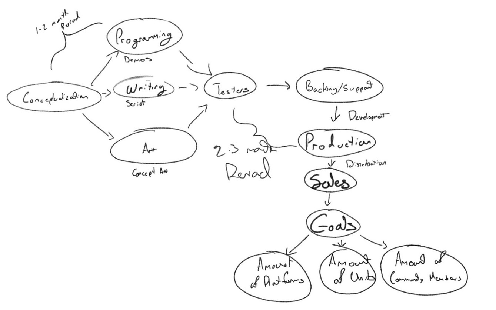
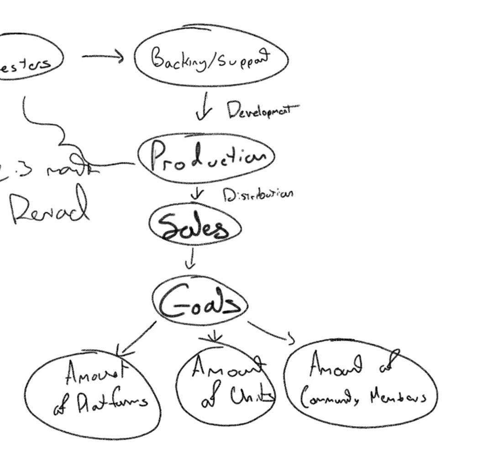

# IS 340: INDIE GAME STUDIO
#### BY ULYSSES MARTINEZ FERMIN

## ABSTRACT
In this paper, I will be looking at the development side of indie game studios. Indie game studios are bound by restrictions, creating games that reach many kinds of people. They attempt to make as big a game as the usual AAA game studies can make with 100+ person teams. These projects are difficult as they don’t have bountiful resources, manpower, and collateral at their disposal. I wanted to build a model plan that could help assist indie game studios be able to work on their projects more efficiently, with the general intention to help with my own game studio in the future. This model plan will cover the intention of indie game studios and how that intention can be kept and pushed. This includes what they can do to gather support, where support can be acquired, and how to utilize it. While this won't cover the actual game development, it will cover what to do to get to the actual production stage and what to expect after. Indie game studios are almost hobbies rather than full-time jobs, so a confident plan can help ensure that those efforts in making games aren’t susceptible to becoming a flop and losing time.

## Introduction

#### BACKGROUND
Indie game studios are game studios that usually involve small groups of people making games. These indie game studios are the pinnacle of making games for fun, as they have no pressure to meet any metric since they do not have any corporate parent to satisfy. Instead, the projects made by indie game studios are motivated by passion and appreciation of the games that came before them, as they usually make games that are unique from others. These games can take years to make, just because they are fueled and supplied by how much the contributors want to put into them. That being said, it also takes years because the contributors are not able to commit their lives to its creation. Indie game studios are usually made up of inspired hobbyists who want to have their take on a game idea they have. This also means indie game studios are made of first-timers in game development, so efficiency is not the most abundant.

Indie game studios can be utilized as contractors, using their skills, creativity, and workflows for specific needs in some cases. This can sometimes be a path for some studios, as the game made was not a complete success or didn’t reach the audience as they expected. While this can look like a failure, it usually is a second chance for some game studios. While their project wasn’t what they wanted their future to be, they have opened a door to opportunities as they have used the game they created as a makeshift cover letter. It potentially provides a different avenue of employment for the studios or for at least some members who contributed to it. This does not only involve the main developers but also involves the community contributors around it, which will be covered later in the paper. 

Usually, indie games will be more unique, niche, and creative in comparison to the AAA blockbusters. This makes the audience that is attracted to these indie games usually be gamers or game enthusiasts. Most people are not familiar with the indie space and are more commonly exposed to popular, trending games. The reason for this is that for some gamers, fatigue can set in on those popular games because they are played by everyone, and other developers make games mimicking the popular ones, which can accompany the hype. This causes game genre saturation and thus makes gamers want to look for a break from the current formula.

#### COMMUNITY
One of the most difficult things indie game studios have right off the bat is having an audience, that is because they have none to start with. It’s even harder for the founders of most indie game studios, as they usually have no repertoire in the game industry and are most likely making their debut into it with their game project. Thus, it is important to know who the audience is most likely to be and how they can retain it. It is equally important to make sure the audience is not just spectators and fanbases, but those who are interested in seeing the project thrive, so much so that they contribute to it.

Most indie games are simple in comparison to blockbuster games produced by AAA game studios. The advantage of this is that the game is more approachable with respect to its kernel, kernel meaning the guts of the game. With the game having a simple structure, it would be advantageous to allow people who are interested in manipulating, altering, or adding, and the best way to do that is to allow the project be available as open source. The benefits of this are that if someone can see the project and get some ideas that they would like to implement, they would be able to do so. Similarly, if they see things within the project that seem cumbersome, they can attempt their own version with a revision of what would be their ideal game. While this can look like someone else running with the developer's idea, it instead works as publicity for the game. One notable example of this is the indie game Lethal Company, where the base game was great, but was fine-tuned by its large modding community. While not Lethal Company developer Zeekersss' original idea, his actions embraced the growing community as he was able to increase his player base simultaneously. What is also important information is knowing what is being changed within the community, as that information can be used to patch the base game in the fanbase’s interest.

On the topic of community, it is important to be able to give them a platform to share their thoughts. The best way to approach this is a public forum. For many games, not just indie games, subreddits from the website Reddit are great starting points for many new ideas. Here, people can publicly voice their opinions and concerns that involve the specific project at hand. If there is an opinion that someone has that resonates with many alike, then that can get upvoted to promote it to a higher priority so that the developers can see it. This forum can also prove helpful to newcomers who are trying to learn more about the project. At the same time, developers can also use this platform to converse with contributors and spectators. This can be in manners such as AMAs (Ask Me Anything) or version updates. Engagement within the community is important as it promotes engagement in the game with a better potential of growing the player base.

#### PROJECT MANAGEMENT
One of the most difficult things about video games in general is all the different media of creativity that are used and orchestrated to operate synchronously. They involve art, music, writing, programming, animation, and other concepts, depending on the game being made. With so many variables, it would be difficult to manage for a small team. Thus, a management platform, Such as Zoho, would prove crucial in providing efficient work. Being able to see statuses on certain aspects of the project informs developers and contributors what is being focused on to prevent redundant overwork. It also helps prevent bottlenecks and ensure the progress of the project is consistent. Zoho proves to be a helpful hub to congregate all contributors to check in wear in production the game is in production, and what is to come next. Regarding the community, public Kanban-style boards, where it can inform community members what is being done, what the current focus is, and what to expect. 

Regarding having the project be open source, GitHub would be the best platform to perform that task. It is the staple that houses many various open-source coding projects. Not only can the developers host their program there, but it also allows developers to have their program be accessible for people who want to modify it. It does a great job in maintaining information from version histories, forks from other developers, and packages to organize everyone’s contributions. 

## IMPLEMENTATION

#### DEVELOPMENT PLATFORMS
There is such a thing as biting off more than one can chew in game development. One of the biggest decisions when it comes to creating games is the game engine you want to use as the framework of the game. Some game studios build their engines from the ground up to surpass any restrictions publicly available game engines might have. However, for an indie developer, it saves both time and money to use what is available and makes it easier for people to contribute, as these engines are more approachable to the masses. Many indie games are built using Unity, which is known for having a strong community and being quite modular and adaptable. With it being so widely used, there are plenty of learning resources on the engine, as well as a large library of assets to build beta or alpha demos without sacrificing too much time.

Regarding programming, the best language to use in tandem with Unity would be C#. While C++ is what is used to build the core for the Unity engine, C# allows for an easier time to build script behavior and logic. Integration is as easy as most of the library of assets are already built using C#, but it is also more approachable as it steps away from low-level languages like C++. Unity has a nice feature that allows C# to be converted into optimized C++ code, which is a big plus when trying to build a game for different platforms, such as consoles, personal computers, or even virtual reality. 

#### GAME DEVELOPMENT

So, what can we do once we have an idea we want to run with? Well, we want to be able to plan a workflow to make sure we can stay on track with what we want to achieve. A workflow is important because it categorizes each stage of development, to let the developers know when they have to meet a deadline, when to call it quits at a certain stage, and when to move on. For video game developers, conceptualization is the first hurdle. This involves developers being visionary on how they want their game to look, which involves concept art, and what the story is going to be, which involves storyboarding and script writing, and how it is going to function, which is where programming comes in. At this stage, the goal should be build a sort of prototype that captures the soul of the game in mind. It might not be great, but it can at least display what the vision was to someone else and let them interact with it. With time, this prototype develops further into a pre-alpha, alpha, and then a beta. Once at the beta stage, the vision has been more refined, and the project has been polished so much so that it should be playable for testers to examine. Game testers are important because they are going to be the first-hand players who will tell you what the game is, how they see it, and if it has any potential. The feedback tells developers if they can run with the idea or if it needs to go back to the drawing board.

Once the testers have given us feedback, it is time for the developers to build. Game systems should be polished and integrated, the story completed, and playable as it was envisioned. This is where developers try to start the digital footprint by publishing a demo. This can be done on Steam, a digital storefront for games, as they allow developers to publish demos and even sometimes endorse them. While this can get the name out there, this only matters if people know that it exists. This is where the power of social media comes in, as well as the power of presence from going to places where enthusiasts go. This can be something like gaming conventions like PAX, E3 (Rest In Peace), and maybe even Comic-Con. Exposure will present first hand reaction to the project and hopefully be ingrained in their memory.

Indie games are hard to build as they are laborious. What makes it a daunting challenge is that the developers take a risk in making a new IP (Intellectual Property). Most indie developers are not full-time developers and are doing it out of interest to see what can happen, almost as a hobby. So once a project can get to the point where it is unofficially greenlit, production is the last mountain that is usually unscalable. Production costs a lot of money, mainly because it takes a lot of time. If there are enough people who want to see the project come to fruition, fundraising can be a method to employ the developers to pursue completion. Kickstarter is a platform commonly used by indie games to ask their supporters for financial aid, in exchange for the ability to create the project they are investing in.

## EXPECTATIONS

#### GOALS

Now that the budget has been accommodated, developers can complete the game with the intent of selling. This is what can be considered the most difficult part of the game’s journey. The game may be completed, but ensuring its success requires some trust from publishers. Online storefronts, like Steam, are very indie-friendly, as their requirements to sell your game are lax. As long as it doesn’t have malware, hate speech, and abides by its terms and conditions, you can sell your game there. However, other platforms such as the console market (Xbox, Nintendo, and PlayStation) require more confidence.  They have platform-specific rules, such as legal stuff, added costs like licensing and certification, and, of course, technical hurdles as they have different APIs and hardware. Even if it is a nuisance to get games on a console, having it available on more platforms only makes the game more accessible to people who don’t have PCs, since consoles are what most people use for gaming.

For this, it is important to set a metric for the project. What can be expected 3 months from release, 6 months from release, 1 year from release? The important metric to monitor is the platforms the game is on, as it can convince other publishers to potentially invest in the project and include it in a subscription model like Game Pass. Another important metric is units sold, as it shows how many people were interested enough to play the game. This can show if it had a slow start, and if word of mouth has exponentially increased popularity, or if it fell off fast, and if some damage control needs to be done. Lastly, another metric to check is the number of community members, but more importantly, the engagement of the community. This shows how people are invested in seeing the game grow, only providing motivation to make the game bigger and better.

#### RISK AND CHALLENGES
Having a successful indie game would be a dream come true, but the reality is that the video game industry is in a rough state. For the past few years, the video game industry has been volatile, with major, successful even, game studios getting scrapped and closing, and large waves of layoffs. The main reason for this is that development cost has only increased. While this is a large problem for large-scale games that AAA developers make, this trickles down to indie developers as well. It costs more to make games than what they can make is the common situation at the moment. Profitable games are the focus, but in order to make things profitable, it needs to guarantee money, which is impossible with games. This is the reason why there is such oversaturation in games because corporate wants to make money by printing games that don’t allow developers be creative, but instead depend on sequels, nostalgia, and live-service adaptations. 

## CONCLUSION

This paper has covered the development of games from an indie games studio and the realities that come with it. It emphasizes the struggles that newcoming developers face and presents a gameplan to how manage these projects. By outlining such a structured plan, it demonstrates how indie game studios can increase their chances of success and chances of accomplishing their passion project without much sacrificing. A good adaptable development plan can ensure efficiency and organize energy spent to minimize hindrance to creativity and engagement. 

References
Bradley, A. (2025). Integrative Project Management: Community Building. University of Illinois at Urbana-Champaign.

Brandt, O. (2025, August 17). Gamescom Co-Organizer Details How They React to a Volatile Games Industry. Newsweek. https://www.newsweek.com/entertainment/video-games/gamescom-co-organizer-details-how-they-react-volatile-games-industry-2114172

Brearton, Rachael. “Developer Interview with Indie Game Creator Jesse Makkonen - Indie Hive.” Indie Hive, 4 June 2025, indie-hive.com/jesse-makkonen-interview/

Dmitriy Byshonkov. (2025, February 10). Video Game Insights: Game Engines on Steam in 2025. Substack.com; GameDev Reports. https://gamedevreports.substack.com/p/video-game-insights-game-engines
