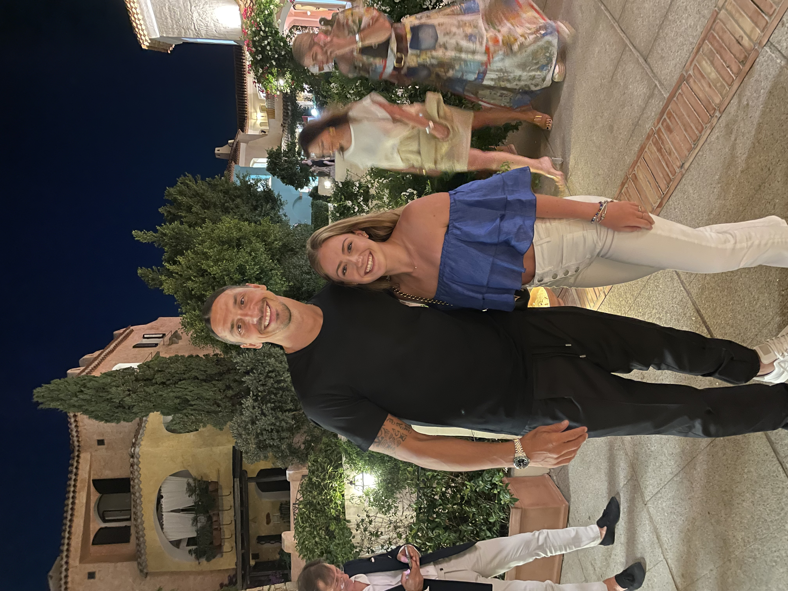

# Hello everyone! My name is Gabriela Sandschafer!
I am currently a senior in Information Science + Data Science with a minor in Business! 
I will be graduating in 3 years and then pursing my masters in Technology Managagement at the Gies College of Business. 
I hope you enjoy getting to know me a little more!!!

## Fun Facts
- I have lived in **five** cities: (1) Chicago, IL (2) Naperville, IL (3) Rochester Hills, Michigan (4) Basel, Switzerland (5) St. Petersburg, Florida
- I have travelled to over **30 different countries** and **18 different states**!
- I have **three nationalities/passports**: American, Brazilian, and Italian
- I speak **two languages fluently**, English and Portuguese, and learned the basics of a German and French when living in Switzerland!
- The most famous person I have met is **Zlatan Ibrahimović** (famous soccer player) - in a small town in Italy by pure coincidence!! 

## Me and Zlatan!

## My Favorite Vacations

| Place | When    | Why    |  
| :-----: | :---: | :---: |  
|  Japan  |  April 2017    | Toyko and Kyoto was unforgettable because of the breathtaking cherry blossoms, rich culture, and incredible food everything. It was so different from everything else I had seen - so vibrant, with beautiful temples!   |  
|  Maldives  | March 2020    | The Maldives felt like a tropical paradise! I fell in love with its crystal clear waters, white sandy beaches, and amazing marine life. I will never forget snorkeling with a whale shark and scuba diving by the reefs. It one of the most relaxing vacations ever - because of that we ended up going again!    |  
|  Tanzania  | July 2023    | Going on a safari in Tanzania was an incredible experience, seeing lions, elephants, giraffes, and many more animals in their natural habitat. The breathtaking landscapes of the Serengeti and the vibrant culture made this trip the most amazing trip ever - I even got to witness The Great Migration!!!  |  

